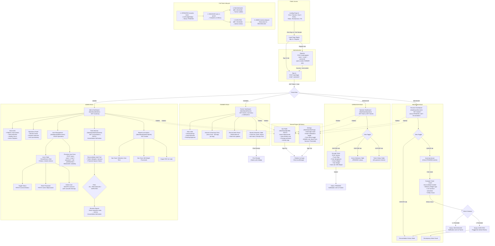

```mermaid
graph TB
  %% ===== PUBLIC =====
  subgraph PUBLIC["Public Access"]
    LANDING["Landing Page (/)
    Hero, Features, How It Works,
    Roles, Testimonials, CTA"]
    LOGIN["Login Page (/login)
    Sign In / Register"]
  end

  LANDING -->|"Click Sign In / Get Started"| LOGIN

  %% ===== AUTH =====
  subgraph AUTH["Authentication"]
    SIGNIN["Sign In
    POST /auth/login
    email + password"]
    REGISTER["Register
    POST /auth/register
    name + email + password
    (auto-creates FARMER role)"]
  end

  LOGIN -->|"Sign In tab"| SIGNIN
  LOGIN -->|"Register tab"| REGISTER
  REGISTER -->|"Success - auto switch"| SIGNIN

  SIGNIN -->|"JWT Token + User"| ROLE_CHECK{"Check Role"}

  ROLE_CHECK -->|FARMER| FARMER_DASH
  ROLE_CHECK -->|OPERATOR| OPERATOR_DASH
  ROLE_CHECK -->|RECEIVER| RECEIVER_DASH
  ROLE_CHECK -->|ADMIN| ADMIN_DASH

  %% ===== SHARED (All Roles) =====
  subgraph SHARED["Shared Pages (All Roles)"]
    PROFILE["My Profile (/dashboard/profile)
    PATCH /users/:id/password
    • View identity card
    • Change password
    • Activity logs"]
    SETTINGS["Settings (/dashboard/settings)
    • Dark/Light mode
    • Email notifications toggle
    • Push alerts toggle
    (ADMIN only: Base Price,
    Variance Threshold)"]
  end

  %% ===== FARMER =====
  subgraph FARMER["FARMER ROLE"]
    FARMER_DASH["Farmer Dashboard (/dashboard/farmer)
    GET /tickets | /summary | /notifications"]
    FARMER_STATS["Stat Cards
    • Total Earnings
    • Total Delivered
    • Pending Approval"]
    FARMER_CHART["Harvest & Earnings Chart
    (Area chart - earnings per day)"]
    FARMER_ALERTS["Recent Alerts Panel
    • Notification list
    • Real-time updates"]
    FARMER_TABLE["Recent Deliveries Table
    • Ticket No | Date | Status
    • Net Value | Receipt Print"]
  end

  FARMER_DASH --> FARMER_STATS
  FARMER_DASH --> FARMER_CHART
  FARMER_DASH --> FARMER_ALERTS
  FARMER_DASH --> FARMER_TABLE
  FARMER_TABLE -->|"Click Receipt"| FARMER_PRINT["Print Receipt
    (Opens print dialog)"]

  %% ===== OPERATOR =====
  subgraph OPERATOR["OPERATOR ROLE"]
    OPERATOR_DASH["Operator Dashboard (/dashboard/operator)
    GET /farms | GET /tickets"]
    OP_ENCODE["Encode Ticket
    POST /tickets
    • Truck Plate
    • Farm (dropdown)
    • Gross Weight
    • Tare Weight
    • Auto-calc: Mill Weight"]
    OP_ACTIVE["Active Deliveries Table
    (PENDING status)"]
    OP_HISTORY["Ticket History Table
    (All operator's tickets)"]
    OP_TOGGLE{"View Toggle"}
  end

  OPERATOR_DASH --> OP_TOGGLE
  OP_TOGGLE -->|"ENCODE tab"| OP_ENCODE
  OP_TOGGLE -->|"ENCODE tab"| OP_ACTIVE
  OP_TOGGLE -->|"HISTORY tab"| OP_HISTORY
  OP_ENCODE -->|"Submit"| TICKET_CREATED["Status: PENDING
    Notification sent to Farmer"]

  %% ===== RECEIVER =====
  subgraph RECEIVER["RECEIVER ROLE"]
    RECEIVER_DASH["Receiver Dashboard (/dashboard/receiver)
    GET /tickets?status=PENDING | GET /reconciliation"]
    REC_QUEUE["Incoming Queue
    (Grid of PENDING tickets)"]
    REC_EVALUATE["Evaluate Ticket
    POST /reconciliation/:ticketId
    • Refinery Weight input
    • Live variance calculation
    • Verify & Sync"]
    REC_HISTORY["Reconciliation History Table"]
    REC_DISPUTES["Discrepancy Alerts Panel"]
    REC_TOGGLE{"View Toggle"}
  end

  RECEIVER_DASH --> REC_TOGGLE
  REC_TOGGLE -->|"QUEUE tab"| REC_QUEUE
  REC_QUEUE -->|"Click ticket"| REC_EVALUATE
  REC_EVALUATE -->|"Verify & Sync"| REC_RESULT{"Check Variance"}
  REC_RESULT -->|"<= Threshold"| RECONCILED["Status: RECONCILED
    Notification sent to Farmer"]
  REC_RESULT -->|"> Threshold"| DISPUTED["Status: DISPUTED
    Flagged for Admin Review"]
  REC_TOGGLE -->|"HISTORY tab"| REC_HISTORY
  RECONCILED --> REC_HISTORY
  DISPUTED --> REC_DISPUTES

  %% ===== ADMIN =====
  subgraph ADMIN["ADMIN ROLE"]
    ADMIN_DASH["Admin Dashboard (/dashboard/admin)
    GET /summary"]
    ADMIN_STATS["Stat Cards
    • Platform Transactions
    • Total Deliveries
    • Healthy Syncs
    • Active Disputes"]
    ADMIN_OPS["Operations Panel
    • Monitor tickets
    • Dispute resolution
    • User provisioning"]

    ADMIN_USERS["User Management (/dashboard/admin/users)
    CRUD Operations"]
    USER_LIST["Users Table
    • Name/Email | Role
    • Status | Joined | Actions"]
    USER_CREATE["Provision User Form
    POST /users
    name + email + password + role
    (OPERATOR / RECEIVER / ADMIN)"]
    USER_TOGGLE["Toggle Status
    PATCH /users/:id/status"]
    USER_RESET["Reset Password
    PATCH /users/:id/password"]
    USER_DELETE["Delete User
    DELETE /users/:id
    (with cascade cleanup)"]

    ADMIN_TICKETS["Ticket Monitor (/dashboard/admin/tickets)
    GET /reconciliation | PATCH /reconciliation/:id/resolve"]
    TICKETS_TABLE["Reconciliation Audit Trail
    • Ticket | Weights | Variance
    • Financial Impact | Status"]
    TICKETS_FILTER{"Filter:
    ALL / RECONCILED / DISPUTED"}
    TICKETS_RESOLVE["Resolve Dispute
    Enter resolution notes
    → PATCH /reconciliation/:id/resolve"]

    ADMIN_REPORTS["Reports & Analytics (/dashboard/admin/reports)
    GET /tickets"]
    REPORTS_CHART1["Bar Chart: Deliveries Over Time"]
    REPORTS_CHART2["Bar Chart: Mill Weight Processed"]
    REPORTS_EXPORT["Export PDF (UI stub)"]
  end

  ADMIN_DASH --> ADMIN_STATS
  ADMIN_DASH --> ADMIN_OPS
  ADMIN_DASH --> ADMIN_USERS
  ADMIN_DASH --> ADMIN_TICKETS
  ADMIN_DASH --> ADMIN_REPORTS

  ADMIN_USERS --> USER_LIST
  ADMIN_USERS --> USER_CREATE
  USER_LIST --> USER_TOGGLE
  USER_LIST --> USER_RESET
  USER_LIST --> USER_DELETE

  ADMIN_TICKETS --> TICKETS_TABLE
  TICKETS_TABLE --> TICKETS_FILTER
  TICKETS_FILTER --> TICKETS_RESOLVE

  ADMIN_REPORTS --> REPORTS_CHART1
  ADMIN_REPORTS --> REPORTS_CHART2
  ADMIN_REPORTS --> REPORTS_EXPORT

  %% ===== SHARED LINKS =====
  FARMER_DASH -.->|Sidebar| PROFILE
  FARMER_DASH -.->|Sidebar| SETTINGS
  OPERATOR_DASH -.->|Sidebar| PROFILE
  OPERATOR_DASH -.->|Sidebar| SETTINGS
  RECEIVER_DASH -.->|Sidebar| PROFILE
  RECEIVER_DASH -.->|Sidebar| SETTINGS
  ADMIN_DASH -.->|Sidebar| PROFILE
  ADMIN_DASH -.->|Sidebar| SETTINGS

  %% ===== SIGNOUT =====
  PROFILE -->|"Sign Out"| LOGOUT["→ Redirect to /login
    Clear localStorage"]
  SETTINGS -->|"Sign Out"| LOGOUT

  %% ===== TICKET LIFECYCLE =====
  subgraph LIFECYCLE["Full Ticket Lifecycle"]
    T1["1. OPERATOR encodes ticket
    at mill weighbridge
    → Status: PENDING"]
    T2["2. RECEIVER sees in queue
    → Evaluates at refinery"]
    T3["3. RECONCILED
    (diff ≤ threshold)
    → Farmer notified"]
    T4["4. DISPUTED
    (diff > threshold)
    → Admin reviews"]
    T5["5. ADMIN resolves dispute
    → Status back to RECONCILED"]
  end

  T1 --> T2
  T2 --> T3
  T2 --> T4
  T4 --> T5
```
