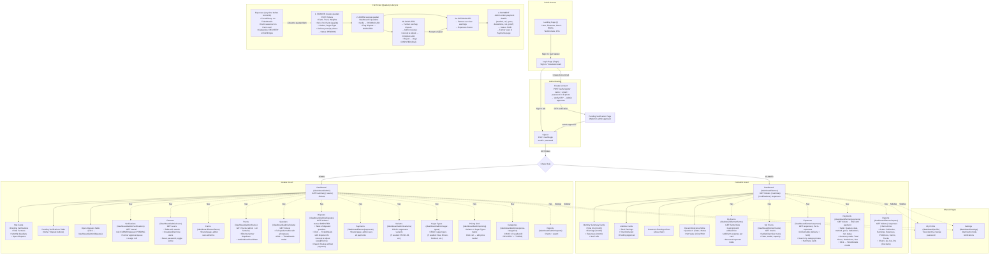

```mermaid
graph TB
  %% ===== PUBLIC =====
  subgraph PUBLIC["Public Access"]
    LANDING["Landing Page (/)
    Hero, Features, How It Works,
    Testimonials, CTA"]
    LOGIN["Login Page (/login)
    Sign In / Create Account"]
  end

  LANDING -->|"Sign In / Get Started"| LOGIN

  %% ===== AUTH =====
  subgraph AUTH["Authentication"]
    SIGNIN["Sign In
    POST /auth/login
    email + password"]
    REGISTER["Create Account
    POST /auth/register
    name + email + password + ID photo
    → Verify OTP → Admin approves"]
  end

  LOGIN -->|"Sign In tab"| SIGNIN
  LOGIN -->|"Create Account tab"| REGISTER
  REGISTER -->|"OTP verification"| PENDING_VERIF["Pending Verification Page
    Waits for admin approval"]
  PENDING_VERIF -->|"Admin approves"| SIGNIN

  SIGNIN -->|"JWT Token"| ROLE_CHECK{"Check Role"}

  ROLE_CHECK -->|FARMER| FARMER_DASH
  ROLE_CHECK -->|ADMIN| ADMIN_DASH

  %% ===== FARMER =====
  subgraph FARMER["FARMER ROLE"]
    FARMER_DASH["Dashboard (/dashboard/farmer)
    GET /tickets | /summary | /notifications | /expenses"]
    FARMER_MONTHLY["Monthly Summary Cards
    • Total KG (month)
    • Earnings (month)
    • Expenses (month)
    • Net Profit"]
    FARMER_LIFETIME["Lifetime Cards
    • Total Earnings
    • Total Delivered
    • Pending Approval"]
    FARMER_CHART["Harvest & Earnings Chart
    (Area chart)"]
    FARMER_TABLE["Recent Deliveries Table
    • Quedan # | Date | Status
    • Net Value | View/Print"]

    FARMS["My Farms (/dashboard/farmer/farms)
    GET /farms/mine
    • Card grid with edit/archive
    • Add farm expense per card
    • Seasonal expense totals"]

    TRUCKS["My Trucks (/dashboard/farmer/trucks)
    GET /trucks
    • Add/edit/archive trucks
    • Plate, model, capacity"]

    EXPENSES["Expenses (/dashboard/farmer/expenses)
    GET /expenses | /farm-expenses
    • Unified table (delivery + farm)
    • Search by category/notes
    • Summary cards"]

    PAYMENTS["Payments (/dashboard/farmer/payments)
    GET /tickets → filter with payment
    • Table: Quedan, date, method, gross, deductions, net, status
    • Summary cards: Total Gross, Deductions, Net
    • Click → TicketDetails modal"]

    REPORTS["Reports (/dashboard/farmer/reports)
    GET /tickets | /expenses | /farms/mine
    • 6 tabs: Deliveries, Earnings, Expenses,
      Profit/Loss, Farms, Trucks
    • Charts: pie, bar, line (Recharts)"]
  end

  FARMER_DASH --> FARMER_MONTHLY
  FARMER_DASH --> FARMER_LIFETIME
  FARMER_DASH --> FARMER_CHART
  FARMER_DASH --> FARMER_TABLE

  %% ===== ADMIN =====
  subgraph ADMIN["ADMIN ROLE"]
    ADMIN_DASH["Dashboard (/dashboard/admin)
    GET /summary | /users | /tickets"]
    ADMIN_STATS["Stat Cards
    • Pending Verifications
    • Total Farmers
    • Monthly Quedans
    • Open Disputes"]
    ADMIN_PENDING["Pending Verifications Table
    (Verify / Dispute buttons)"]
    ADMIN_DISPUTES_LIST["Open Disputes Table
    (Click → /dashboard/admin/disputes)"]

    VERIFICATIONS["Verifications (/dashboard/admin/verifications)
    GET /users?role=FARMER&status=PENDING
    • Farmer approval queue
    • Assign mill"]

    USERS["Farmers (/dashboard/admin/users)
    GET /users
    • Table with search
    • Create/edit/archive users
    • Reset password, toggle active"]

    FARMS_ADMIN["Farms (/dashboard/farmer/farms)
    Shared page, admin sees all farms"]

    TRUCKS_ADMIN["Trucks (/dashboard/admin/trucks)
    GET /trucks (admin = all farmers)
    • Filter by farmer dropdown
    • Add/edit/archive/delete"]

    QUEDANS["Quedans (/dashboard/admin/tickets)
    GET /tickets
    • Full quedan table with all statuses
    • Click → TicketDetails modal"]

    DISPUTES["Disputes (/dashboard/admin/disputes)
    GET /tickets?status=DISPUTED
    • Table of disputed quedans
    • Click → TicketDetails with dispute info
    • Accept & Adjust (weight/price)
    • Reject (finalize without payment)"]

    PAYMENTS_ADMIN["Payments (/dashboard/farmer/payments)
    Shared page, admin sees all payments"]

    VARIANTS["Variants (/dashboard/admin/variants)
    CRUD: sugarcane variants
    (5 seeded: Phil 93-93, etc.)"]

    SUGAR_TYPES["Sugar Types (/dashboard/admin/sugar-types)
    CRUD: sugar types
    (5 seeded: Raw, Brown, Refined, etc.)"]

    PRICING["Pricing Grid (/dashboard/admin/pricing)
    Variants × Sugar Types matrix
    Click cell → edit price modal"]

    CATEGORIES["Categories (/dashboard/admin/expense-categories)
    CRUD: 13 seeded (6 DELIVERY + 7 FARM)"]

    REPORTS_ADMIN["Reports (/dashboard/admin/reports)
    Charts + export"]
  end

  ADMIN_DASH --> ADMIN_STATS
  ADMIN_DASH --> ADMIN_PENDING
  ADMIN_DASH --> ADMIN_DISPUTES_LIST

  %% ===== TICKET LIFECYCLE =====
  subgraph LIFECYCLE["Full Ticket (Quedan) Lifecycle"]
    T1["1. FARMER creates quedan
    POST /tickets
    • Farm, Truck, Weights
    • Brix, Pol, Purity (quality)
    • Variant, Sugar Type
    • Delivery receipt photos
    → Status: PENDING"]
    T2["2. ADMIN reviews quedan
    Dashboard / Quedans
    • Verify → RECONCILED
    • Flag Dispute → DISPUTED"]
    T3["3a. RECONCILED
    → Farmer can view earnings
    → Expenses frozen"]
    T4["3b. DISPUTED
    → Farmer can flag dispute
    → Admin reviews:
      • Accept & Adjust → RECONCILED
      • Reject → stays DISPUTED (final)"]
    T5["4. PAYMENT
    Admin enters payment details
    (method, ref, gross, deductions, net, proof)
    → Status: PAID
    → Farmer sees in Payments page"]
    T3e["Expenses (any time before reconcile)
    • Per-delivery: on TicketDetails
    • Farm seasonal: on Farm card
    • Categories: DELIVERY or FARM type"]
  end

  T1 --> T2
  T2 --> T3
  T2 --> T4
  T3 --> T5
  T4 -->|"Accept & Adjust"| T3
  T3e -.->|"Linked to quedan/farm"| T1

  %% ===== SHARED =====
  subgraph SHARED["Shared Pages"]
    PROFILE["My Profile (/dashboard/profile)
    View identity, change password"]
    SETTINGS["Settings (/dashboard/settings)
    Dark/Light mode, notifications"]
  end

  FARMER_DASH -.->|Sidebar| PROFILE
  FARMER_DASH -.->|Sidebar| SETTINGS
  ADMIN_DASH -.->|Sidebar| PROFILE
  ADMIN_DASH -.->|Sidebar| SETTINGS

  %% ===== FARMER NAV =====
  FARMER_DASH -.->|Nav| FARMS
  FARMER_DASH -.->|Nav| TRUCKS
  FARMER_DASH -.->|Nav| EXPENSES
  FARMER_DASH -.->|Nav| PAYMENTS
  FARMER_DASH -.->|Nav| REPORTS

  %% ===== ADMIN NAV =====
  ADMIN_DASH -.->|Nav| VERIFICATIONS
  ADMIN_DASH -.->|Nav| USERS
  ADMIN_DASH -.->|Nav| FARMS_ADMIN
  ADMIN_DASH -.->|Nav| TRUCKS_ADMIN
  ADMIN_DASH -.->|Nav| QUEDANS
  ADMIN_DASH -.->|Nav| DISPUTES
  ADMIN_DASH -.->|Nav| PAYMENTS_ADMIN
  ADMIN_DASH -.->|Nav| VARIANTS
  ADMIN_DASH -.->|Nav| SUGAR_TYPES
  ADMIN_DASH -.->|Nav| PRICING
  ADMIN_DASH -.->|Nav| CATEGORIES
  ADMIN_DASH -.->|Nav| REPORTS_ADMIN
```
